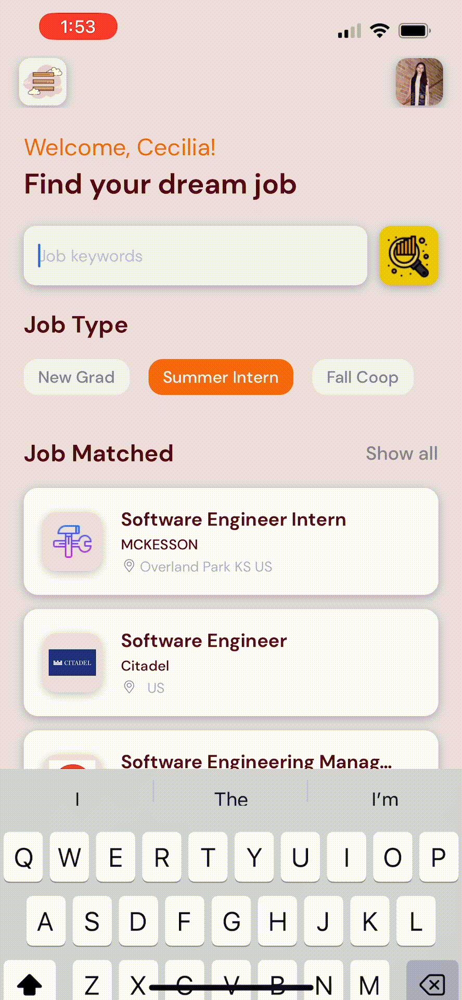
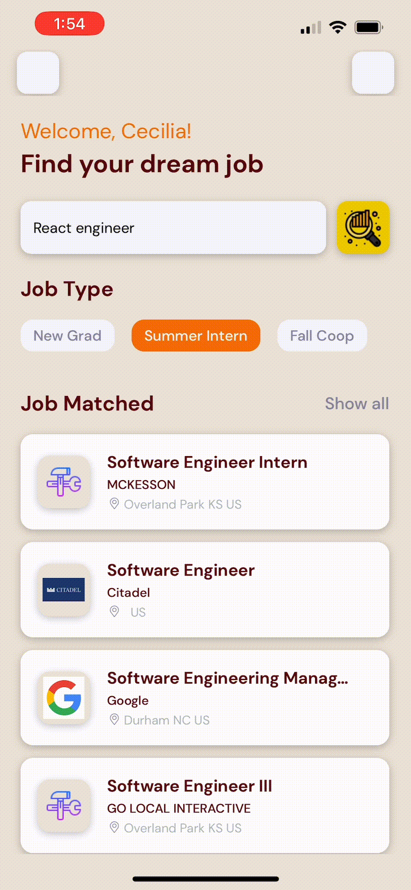
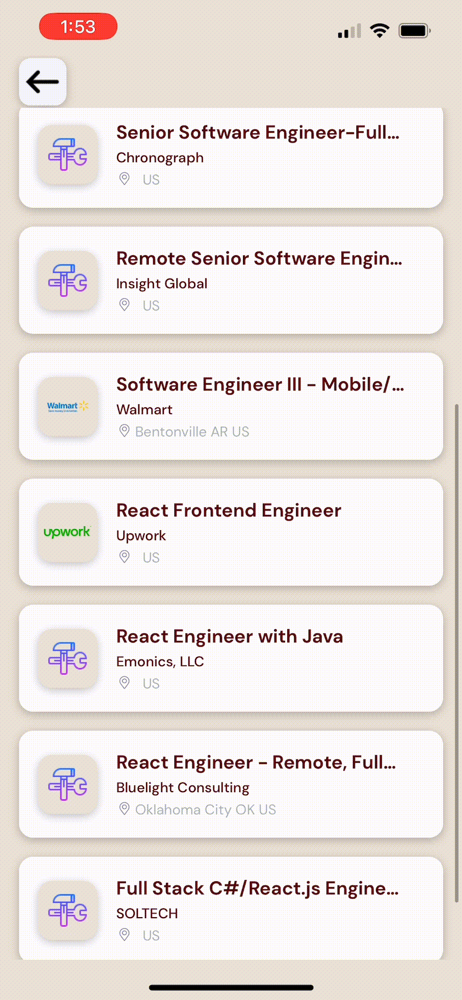

<div align="left">

  <h1>Job Seeking Mobile App</h1>

<div align="center">


</div>

  <p>
The Job Seeking Mobile App is a React Native project developed with JavaScript. It seamlessly collects job listings from popular platforms like LinkedIn, Glassdoor, and official company websites. By integrating a custom API, it retrieves data from external sources, ensuring a robust and efficient user experience. The app is thoroughly tested on Expo and Git is utilized for version control.
  </p>

<a href="https://drive.google.com/file/d/1fB4Vkwj0bNLWoGTleVA6737TJPUTwgAG/view?usp=sharing" target="_blank">DEMO VIDEO 🔗</a>

<br />

<h2>Demo showcase via Expo Go</h2>
https://expo.dev/@cecilia1123/jobSeekingApp

<br />

<!-- Table of contents -->
## Table of Contents

- [About the Project](#star2-about-the-project)
  - [Tech Stack](#tech-stack)
  - [Application Features](#application-features)
    - [Homepage](#homepage)
    - [Search Bar](#search-bar)
    - [Job Description](#job-description)
    - [Apply Job](#apply-job)
    - [Turn Page](#turn-page)
    - [Filter Job](#filter-job)
- [Getting Started](#getting-started)
- [Developer](#developer)

<br />

<!-- Tech Stack -->
## Tech Stack
### Languages:


### Frameworks, Platforms and Libraries:


[(Back to top)](#table-of-contents)

<br />


<!-- Application Features -->
## Application Features

### Homepage

  
[(Back to top)](#table-of-contents)
  
### Search Bar 

  
[(Back to top)](#table-of-contents)
  
### Job Description

  
[(Back to top)](#table-of-contents)
  
### Apply Job

  
[(Back to top)](#table-of-contents)
  
### Turn Page

  
[(Back to top)](#table-of-contents)
  
### Filter Job

  
[(Back to top)](#table-of-contents)

<br />

<!-- Getting Started -->
## Getting Started

### Expo Router Example

Use [`expo-router`](https://expo.github.io/router) to build native navigation using files in the `app/` directory.

### 🚀 How to use

```sh
npx create-expo-app -e with-router
npm install expo-font axios react-native-dotenv
npm install -g expo-cli
expo-cli start --tunnel
```

### 📝 Notes

- [Expo Router: Docs](https://expo.github.io/router)
- [Expo Router: Repo](https://github.com/expo/router)


<!-- developer -->
## Developer
**Cecilia Deng** - https://www.linkedin.com/in/yinglu-cecilia-deng/<br/>
**Demo link** - https://drive.google.com/file/d/1fB4Vkwj0bNLWoGTleVA6737TJPUTwgAG/view?usp=sharing
**Expo Go Showcase** - https://expo.dev/@cecilia1123/jobSeekingApp

<br />
  
[(Back to top)](#table-of-contents)
